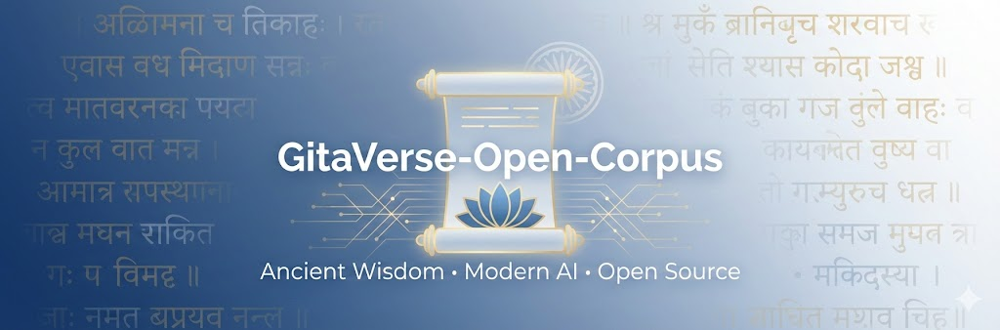

# 🌼 GitaVerse-Open-Corpus

### An Open, Structured, AI-Ready Corpus of the Bhagavad Gita for RAG, LLM Fine-Tuning, and Research

> Ancient wisdom meets modern AI.

GitaVerse-Open-Corpus is a **comprehensive, open-source dataset collection** built from publicly available Bhagavad Gita datasets, processed and reorganized into a **clean, structured, canonical format** suitable for:

- ✅ LLM fine-tuning (instruction, dialogue, persona)
- ✅ Retrieval-Augmented Generation (RAG)
- ✅ Vector database indexing
- ✅ Semantic search engines
- ✅ Agentic AI systems
- ✅ Spiritual and educational applications
- ✅ Academic and linguistic research

This project bridges the gap between **ancient scripture** and **modern AI development**, enabling developers, researchers, and practitioners to build meaningful and responsible AI systems grounded in timeless knowledge.

---

# 📦 Repository Contents

```

GitaVerse-Open-Corpus/
│
├── datasets/
│   ├── scriptures/
│   │   ├── K1_original/
│   │   ├── K1_processed/
│   │   ├── K2_original/
│   │   ├── K2_processed/
│   │   ├── HF2_original/
│   │   ├── HF2_processed/
│   │   ├── HF3_original/      (GH1 same)
│   │   ├── HF3_processed/
│   │   ├── GH2_original/
│   │   ├── GH2_processed/
│   │   ├── GH3_original/
│   │   └── GH3_processed/
│   │
│   ├── qna/
│   │   ├── HF1_original/
│   │   ├── HF1_processed/
│   │   ├── K3_original/
│   │   ├── K3_processed/
│   │   ├── clustered_qna/
│   │   └── master_qna/        (future)
│   │
│   └── metadata/
│       ├── data_sources.csv
│       └── LICENSES.md
│
├── docs/
│   ├── DATASET_ARCHITECTURE.md
│   ├── SCRIPT_DOCUMENTATION.md
│   ├── USE_CASES.md
│   └── RAG_AND_LLMS_GUIDE.md
│   
├── scripts/             # processing pipeline
|
├── LICENSE
├── README.md
└── CONTRIBUTING.md

```

---

# 📚 Included Dataset Types

This repository includes **processed outputs only**, not original datasets.

We provide:

✅ Canonicalized verse datasets

✅ Canonicalized modern Q&A datasets

✅ Clustered & deduplicated Q&A versions

✅ Commentary-augmented verse structures (GH3 processed)

✅ Metadata linking sources and licenses

We do **NOT** redistribute original datasets.

Instead, we provide:

- Links to original repositories
- Licensing information
- Processing methodology

See:

```

datasets/metadata/data_sources.csv

```

## 1️⃣ **Scripture Datasets**

| Code                | Source      | Description                                                 |
| ------------------- | ----------- | ----------------------------------------------------------- |
| **K1**        | Kaggle      | Sanskrit + English meanings                                 |
| **K2**        | Kaggle      | Sanskrit + Transliteration + Hindi + English                |
| **HF2**       | HuggingFace | Fully aligned Sanskrit–Hindi–English verses               |
| **HF3 / GH1** | GitHub      | Modular dataset (chapter, verse, translation, commentaries) |
| **GH2**       | Github      | Chapter-wise structured JSON                                |
| **GH3**       | GitHub      | Multi-author commentary dataset (extensive)                 |

All these are processed into **canonical JSONL formats** ideal for LLM work.

---

## 2️⃣ **Q&A Datasets**

| Code                    | Source                   | Description                                    |
| ----------------------- | ------------------------ | ---------------------------------------------- |
| **HF1**           | HuggingFace              | Verse-wise Q&A (Hindi + English)               |
| **K3**            | Kaggle - Modern Life Q&A | Persona-based, verse-aligned, deep reflections |
| **Clustered QnA** | Our processing           | Semantic deduplication of 19,902 Q&A pairs     |

These datasets form the backbone of:

* semantic search
* “Did you mean this?” suggestions
* user question enrichment
* training specialized Gita philosophical models

---

# 🧠 Why This Repository Matters

Most Bhagavad Gita datasets online are:

- fragmented
- inconsistent
- poorly structured
- non-machine friendly
- mixing commentary formats
- lacking verse alignment
- not suitable for AI training

This project:

✅ normalizes structures

✅ fixes verse alignment

✅ standardizes Q&A format

✅ deduplicates semantic duplicates using embeddings

✅ creates AI-ready JSONL formats

✅ adds metadata & provenance tracking

---

# 💡 What You Can Build with This Suite

### 🔹 **RAG Systems**

* Scripture-level retrieval
* Commentary-aware retrieval
* Modern-question similarity retrieval
* Sanskrit/Hindi/English cross-language retrieval

### 🔹 **Fine-Tuned Gita Models**

* SFT models on pure Q&A
* Commentary-aware LLM
* Persona-based (18 personas from K3) “Chapter-specialist” models
* Verse-expansion generator

### 🔹 **Apps & Agents**

* “Ask Krishna” chatbot
* Dharma-based life guidance assistant
* Leadership lessons explainer
* Spiritual journaling & reflection app
* Anxiety/depression support (within ethical limits)

### 🔹 **Educational Tools**

* Quiz generators
* Flashcards
* Sanskrit learning helpers
* Commentary comparison tools

### 🔹 **Research**

* Cross-dataset variance study
* Commentary lineage analysis
* Semantic clustering of verses
* Tropes & theme modeling

This suite is arguably the most complete *open Bhagavad Gita machine-learning dataset collection* currently available.

---

# 🎓 Academic Value

The unified design enables:

* multi-dataset triangulation
* reduction of hallucination
* citation-ready canonical format
* stable IDs for verse, Q&A, commentary
* future expansion to Upanishads, Vedas, Ramayana, Mahabharata

See:

```

docs/USE_CASES.md

docs/RAG_AND_LLMS_GUIDE.md

```

---

# 🏗️ Dataset Architecture

The processed datasets follow a **strict canonical schema**.

Example canonical Q&A format:

```

{

"question": "...",

"answer": "...",

"chapter": 4,

"verse": "4.7",

"source": "HF1",

"qid": "HF1-en-4:7-032"

}

```

Example canonical verse format:

```

{

"chapter": 2,

"verse": 47,

"sanskrit": "...",

"english": "...",

"hindi": "...",

"commentaries": [...],

"sources": ["GH3","HF2"]

}

```

Full architecture:

```

docs/DATASET_ARCHITECTURE.md

```

---

# 🧰 Processing Pipeline

All transformations are performed using reproducible scripts located in:

```

scripts/

```

Major processing steps:

- canonicalization
- normalization
- clustering (semantic deduplication)
- commentary extraction
- verse metadata alignment

Full documentation:

```

docs/SCRIPT_DOCUMENTATION.md

```

---

# 🔎 Clustering & Deduplication

We apply semantic clustering using:

- SentenceTransformers embeddings
- Cosine similarity
- Threshold-based grouping

This reduces Q&A data by ~50% while preserving meaning.

Outputs include:

```

hf1_qa_clustered.jsonl

k3_qa_clustered.jsonl

```

---

# 🌍 Licensing

This repository is released under:

**Creative Commons Attribution 4.0 International (CC BY 4.0)**

You may:

✅ Share

✅ Adapt

✅ Use commercially

Under the requirement:

- Provide attribution to this repository

---

# 📎 Attribution

If you use this dataset in research or products:

Please cite:

```

GitaVerse-Open-Corpus (2025), Animesh Shaw & Tattva Chronicles, https://github.com/Tattva-Chronicles/GitaVerse-Open-Corpus

```

---

# 🧾 Sources

This project builds upon publicly available datasets including:

- Kaggle Bhagavad Gita datasets (K1, K2)
- HuggingFace datasets (HF1, HF2, HF3)
- GitHub repositories (GH1, GH2, GH3)
- DharmicData collections

We claim **no ownership** over original texts.

This repository contains **only processed outputs**, not raw sources.

---

# 🛠️ Contributing

We welcome:

- dataset contributions
- new commentary mappings
- language additions
- tooling improvements
- documentation enhancements

See:

```

CONTRIBUTING.md

```

---

# ⭐ Why This Repository Is Unique

This is the **first open dataset** that:

✅ combines scripture + commentary + modern Q&A

✅ standardizes formats across 10+ sources

✅ deduplicates semantically

✅ is designed explicitly for AI systems

✅ provides documented processing scripts

✅ prioritizes openness and attribution

---

# 🌸 Final Words

This project aims to:

- preserve ancient knowledge
- enable meaningful AI applications
- support research and education
- promote responsible spiritual AI

If this helps you, please ⭐ star the repository and Support the Initiative!

🙏 Hari Om

---

# ✅ Citation Formats

📑 BibTeX

```
@dataset{gitaverse_2025,
  title        = {GitaVerse-Open-Corpus},
  author       = {Shaw, Animesh and Contributors},
  year         = {2025},
  publisher    = {GitHub},
  url          = {https://github.com/Tattva-Chronicles/GitaVerse-Open-Corpus},
  license      = {CC-BY-4.0},
  note         = {Open structured corpus for AI and research based on the Bhagavad Gita}
}
```

📚 APA

```
Shaw, A., & Contributors. (2025). GitaVerse-Open-Corpus [Dataset]. GitHub.
https://github.com/Tattva-Chronicles/GitaVerse-Open-Corpus.
```

📰 MLA

```
Shaw, Animesh, and Contributors. "GitaVerse-Open-Corpus." 2025. GitHub,
https://github.com/Tattva-Chronicles/GitaVerse-Open-Corpus.
```


